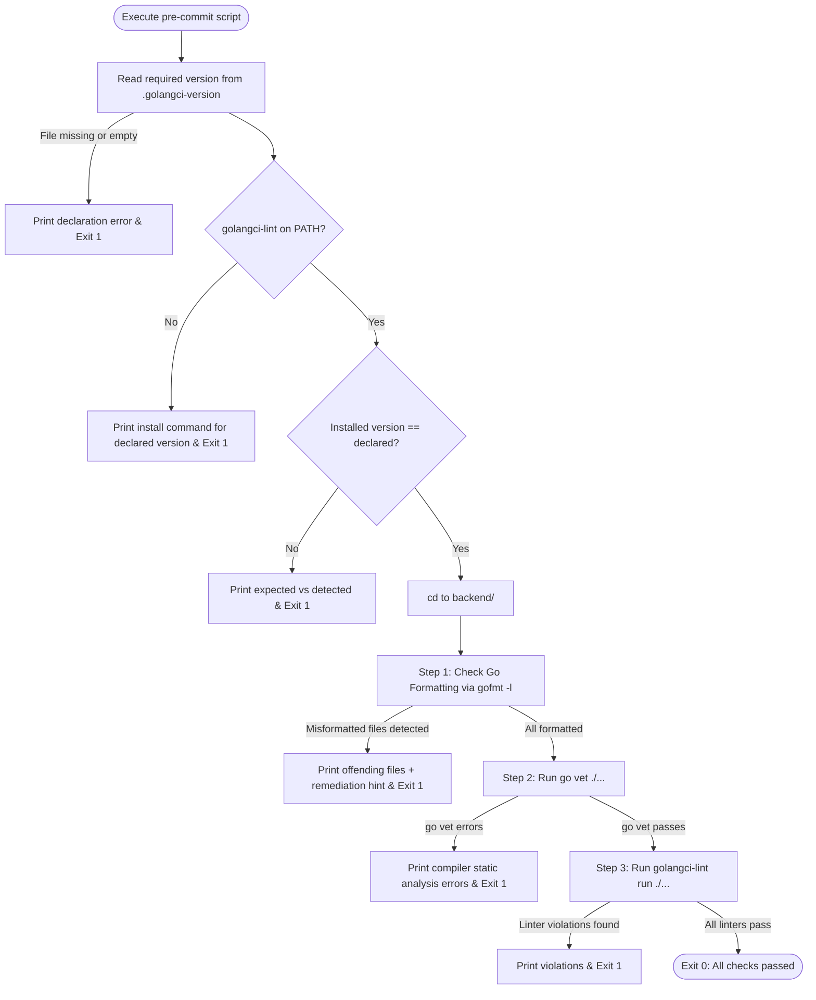

# Interface Contract: Precommit Hook Script

**Feature Branch**: `001-github-actions-ci`  
**Contract Version**: 2.0.0  
**Target Files**: `scripts/pre-commit.sh`, `.githooks/pre-commit`, `.golangci-version`  

---

## 1. Scope & Execution Modes

The precommit hook script enforces Go formatting and static analysis rules identically across two execution modes:

1. **Local Developer Execution**:
   - Manually triggered via `./scripts/pre-commit.sh`.
   - Automatically triggered prior to `git commit` when `.githooks` is configured via `git config core.hooksPath .githooks`.
2. **Remote CI Execution**:
   - Invoked directly in the `backend` job of `.github/workflows/ci.yml`.

A single implementation covers Linux, macOS, and Windows; on Windows it runs under
the Bash runtime bundled with Git. Per-platform duplicates are not kept, because
only the invoked one would ever be exercised by the hook and by CI (FR-015).

---

## 2. Interface Specification

### 2.1 Inputs & Environment

- **Working Directory**: Can be executed from repository root or subdirectories (script resolves repository root dynamically).
- **Version Declaration**: `.golangci-version` at the repository root is the single
  source of truth for the required `golangci-lint` version (FR-013). Both this script
  and `.github/workflows/ci.yml` resolve the version from it; neither hardcodes it.
- **Environment Variables**: none alter the set of checks performed. The script
  behaves identically locally and in CI: every configured check runs, or the script
  fails (FR-012). There is no environment in which a check is skipped.

### 2.2 Checks Executed



### 2.3 Diagnostic Messages & Remediation Hints

- **Missing Linter Binary** (FR-012):
  ```text
  [ERROR] golangci-lint is required but was not found in PATH.
  Install the declared version with:
    go install github.com/golangci/golangci-lint/v2/cmd/golangci-lint@v2.12.1
  Other installation methods: https://golangci-lint.run/welcome/install/
  ```
- **Version Mismatch** (FR-014):
  ```text
  [ERROR] golangci-lint version mismatch: local checks would not match CI.
    expected: 2.12.1 (declared in .golangci-version)
    detected: 2.9.0
  ```
- **Formatting Failure**:
  ```text
  [ERROR] The following Go files are not formatted according to gofmt:
  internal/service/player.go
  To fix, run: gofmt -w backend/
  ```
- **Static Analysis Failure (`go vet`)**:
  ```text
  [ERROR] go vet reported compiler/analysis defects. Review diagnostic output above.
  ```
- **Static Analysis Failure (`golangci-lint`)**:
  ```text
  [ERROR] golangci-lint reported rule violations according to backend/.golangci.yml.
  ```

---

## 3. Exit Code Contract

| Condition | Exit Code | Diagnostic Output |
|---|---|---|
| All checks pass | `0` | `[SUCCESS] All backend pre-commit checks passed.` |
| `.golangci-version` missing or empty | `1` | Version declaration error |
| `golangci-lint` not found on PATH | `1` | Missing binary error + install command for the declared version |
| Installed `golangci-lint` version differs from declared | `1` | Expected vs detected version + install command |
| One or more files misformatted | `1` | List of unformatted files + `gofmt -w` command |
| `go vet` detects static issues | `1` | Compiler vet findings |
| `golangci-lint` detects rule violations | `1` | Linter findings with file and line references |

The script never exits `0` having skipped a configured check (FR-012).

---

## 4. Git Hook Activation Contract

To install the pre-commit hook into a local developer environment:
```bash
git config core.hooksPath .githooks
```
File `.githooks/pre-commit`:
```bash
#!/usr/bin/env bash
exec ./scripts/pre-commit.sh
```
This delegates git pre-commit checks to `scripts/pre-commit.sh` without file copying or hardcoded paths.

---

## 5. Line Ending Contract

`.gitattributes` declares `*.go text eol=lf` and `*.sh text eol=lf` (FR-011), so the
checkout writes LF on Windows, macOS, and Linux alike. Without it, `gofmt` flags on a
Windows working tree files that are correctly formatted on the Linux CI runner, and a
CRLF `scripts/pre-commit.sh` fails on the runner with a misleading syntax error. The
guarantee does not depend on each developer's `core.autocrlf`.
