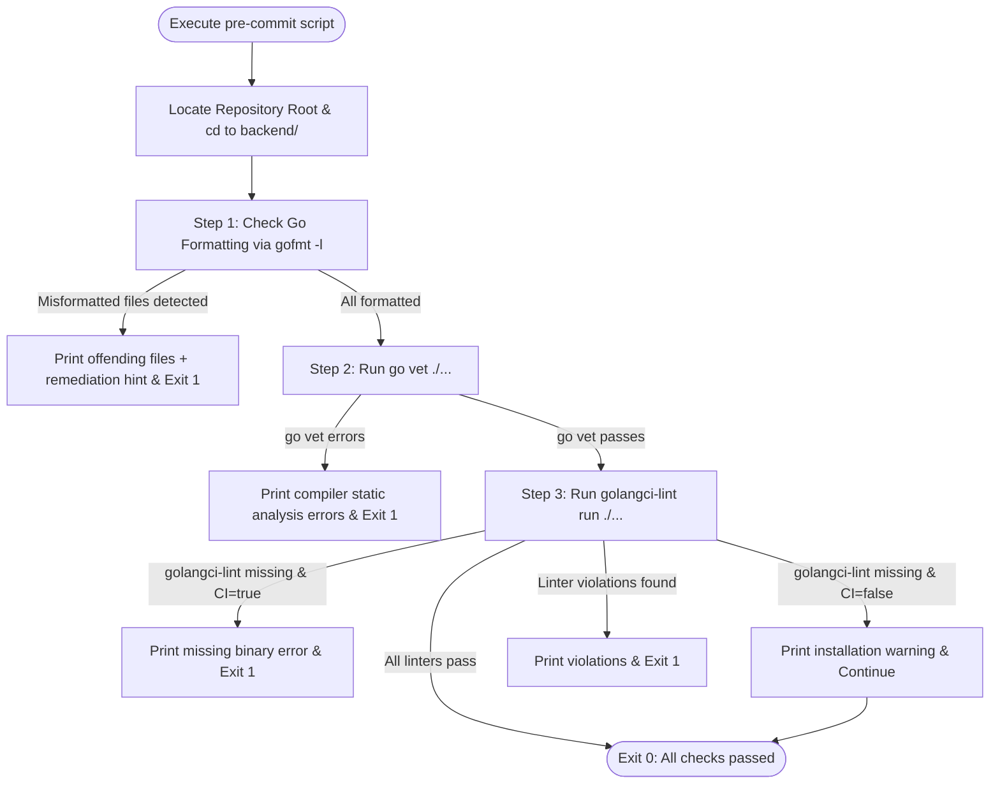

# Interface Contract: Precommit Hook Script

**Feature Branch**: `001-github-actions-ci`  
**Contract Version**: 1.0.0  
**Target Files**: `scripts/pre-commit.sh`, `scripts/pre-commit.ps1`, `.githooks/pre-commit`  

---

## 1. Scope & Execution Modes

The precommit hook script enforces Go formatting and static analysis rules identically across two execution modes:

1. **Local Developer Execution**:
   - Manually triggered via `./scripts/pre-commit.sh` (or `pwsh ./scripts/pre-commit.ps1`).
   - Automatically triggered prior to `git commit` when `.githooks` is configured via `git config core.hooksPath .githooks`.
2. **Remote CI Execution**:
   - Invoked directly in the `backend` job of `.github/workflows/ci.yml`.
   - Runs with environment variable `CI=true` (automatically set by GitHub Actions runner).

---

## 2. Interface Specification

### 2.1 Inputs & Environment
- **Working Directory**: Can be executed from repository root or subdirectories (script resolves repository root dynamically).
- **Environment Variables**:
  - `CI`: If set to `true`, mandates that `golangci-lint` is present and exits 1 if not found. If unset or `false`, treats missing `golangci-lint` as a non-blocking warning for local developer convenience while strictly enforcing `gofmt` and `go vet`.

### 2.2 Checks Executed



### 2.3 Diagnostic Messages & Remediation Hints
- **Formatting Failure**:
  ```text
  [ERROR] The following Go files are not formatted according to gofmt:
  internal/service/player.go
  To fix, run: gofmt -w backend/
  ```
- **Static Analysis Failure (`go vet`)**:
  ```text
  [ERROR] go vet reported compiler/analysis defects. Review diagnostic output above.
  ```
- **Static Analysis Failure (`golangci-lint`)**:
  ```text
  [ERROR] golangci-lint reported rule violations according to backend/.golangci.yml.
  ```

---

## 3. Exit Code Contract

| Condition | Exit Code | Diagnostic Output |
|---|---|---|
| All checks pass | `0` | `[SUCCESS] All backend pre-commit checks passed.` |
| One or more files misformatted | `1` | List of unformatted files + `gofmt -w` command |
| `go vet` detects static issues | `1` | Compiler vet findings |
| `golangci-lint` detects rule violations | `1` | Linter findings with file and line references |
| `golangci-lint` missing when `CI=true` | `1` | Missing binary error |

---

## 4. Git Hook Activation Contract

To install the pre-commit hook into a local developer environment:
```bash
git config core.hooksPath .githooks
```
File `.githooks/pre-commit`:
```bash
#!/usr/bin/env bash
exec ./scripts/pre-commit.sh
```
This delegates git pre-commit checks to `scripts/pre-commit.sh` without file copying or hardcoded paths.
