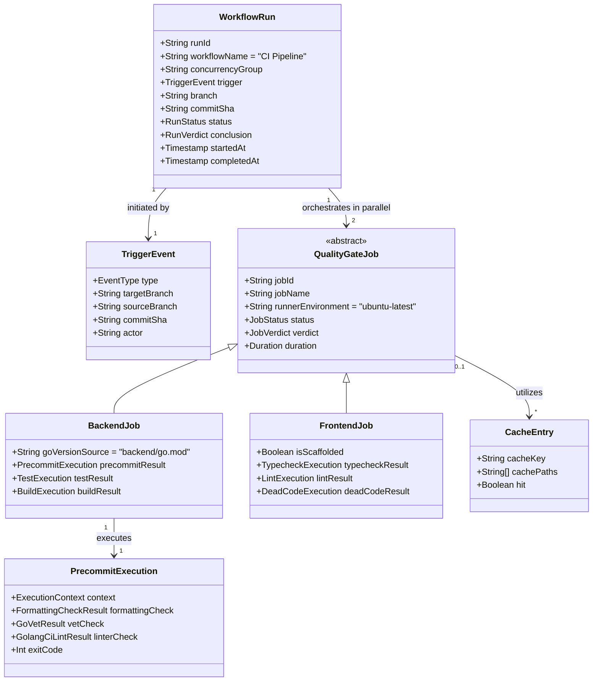
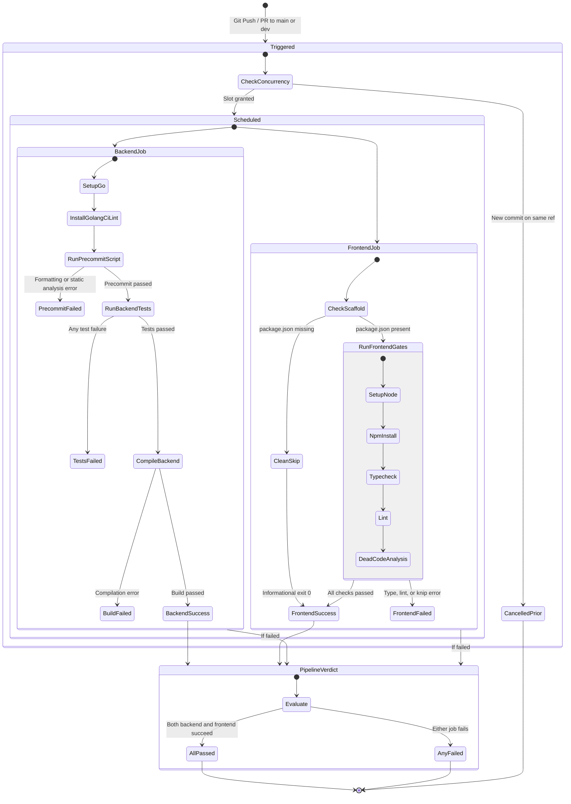

# Data Model: GitHub Actions CI Pipeline

**Feature Branch**: `001-github-actions-ci`  
**Date**: 2026-09-10  
**Status**: Completed  

## Overview

The CI pipeline domain models ephemeral workflow executions, parallel quality gate jobs, precommit verification stages, and trigger lifecycles. Although these entities do not persist in an application database, they define the formal schema and behavior of the GitHub Actions CI system and developer git hooks.

---

## Domain Class Diagram

---

## 1. Pipeline Entities

### 1.1 `WorkflowRun`
Represents an execution instance of `.github/workflows/ci.yml`.

- **Attributes**:
  - `runId`: Unique integer assigned by GitHub Actions (`github.run_id`).
  - `workflowName`: `"CI Pipeline"`.
  - `concurrencyGroup`: `"ci-${{ github.workflow }}-${{ github.ref }}"`.
  - `trigger`: Associated `TriggerEvent`.
  - `branch`: Target git reference (`github.ref_name`).
  - `commitSha`: Head commit SHA (`github.sha`).
  - `status`: `queued`, `in_progress`, `completed`.
  - `conclusion`: `success`, `failure`, `cancelled`.

### 1.2 `TriggerEvent`
Represents the incoming git event initiating the pipeline.

- **Attributes**:
  - `type`: `push` or `pull_request`.
  - `targetBranch`: Must match `main` or `dev` (FR-001, FR-002).
  - `sourceBranch`: Head branch name for PRs.
  - `commitSha`: Target commit hash.
  - `actor`: Committer or PR author.

### 1.3 `BackendJob`
Represents the `backend` quality gate job inside the workflow.

- **Attributes**:
  - `jobId`: `"backend"`.
  - `jobName`: `"Backend Verification & Tests"`.
  - `runner`: `"ubuntu-latest"`.
  - `steps`:
    1. Checkout (`actions/checkout@v4`)
    2. Set up Go (`actions/setup-go@v5` reading `backend/go.mod`)
    3. Install `golangci-lint` binary (`v1.64.5`)
    4. Run Precommit Hook Script (`./scripts/pre-commit.sh`)
    5. Run Backend Tests (`go test -v -race ./...`)
    6. Compile Backend (`go build -v ./...`)
  - `failConditions`: Formatting diff detected, `go vet` warnings, `golangci-lint` rule violations, test assertions failed, or compiler errors.

### 1.4 `FrontendJob`
Represents the `frontend` quality gate job inside the workflow.

- **Attributes**:
  - `jobId`: `"frontend"`.
  - `jobName`: `"Frontend Verification"`.
  - `runner`: `"ubuntu-latest"`.
  - `scaffoldGuard`:
    - Checks `frontend/package.json`.
    - If missing: Sets `scaffolded=false`, skips remaining steps, finishes with status `success` (exit 0).
    - If present: Sets `scaffolded=true`, proceeds to full checks.
  - `steps` (when scaffolded):
    1. Checkout (`actions/checkout@v4`)
    2. Check scaffold state (scaffold guard)
    3. Set up Node.js (`actions/setup-node@v4` with Node 22 + npm cache)
    4. Install dependencies (`npm ci`)
    5. TypeScript compilation check (`npm run typecheck`)
    6. Linting (`npm run lint`)
    7. Dead-code static analysis (`npx knip`)
  - `failConditions`: Type errors (`tsc`), ESLint errors, or unused code/exports (`knip`).

### 1.5 `PrecommitExecution`
Represents the execution of the shared precommit hook script (`scripts/pre-commit.sh` / `scripts/pre-commit.ps1`).

- **Attributes**:
  - `context`: `LocalGitHook`, `LocalManual`, or `RemoteCI`.
  - `formattingCheck`: Output of `gofmt -l backend/`. Zero output required for pass.
  - `vetCheck`: Output of `go vet ./...` in `backend/`. Zero warnings required for pass.
  - `linterCheck`: Output of `golangci-lint run ./...` in `backend/`. Zero issues required for pass. In CI, binary must be available.
  - `exitCode`: 0 on total pass, 1 on any violation.

---

## 2. Quality Gate Verdicts Matrix

| Quality Gate | Tool / Command | Input Scope | Pass Condition | Failure Behavior |
|---|---|---|---|---|
| **Go Formatting** | `gofmt -l .` | `backend/**/*.go` | Zero stdout | Lists unformatted files; exits 1 |
| **Go Static Analysis** | `go vet ./...` | `backend/...` | Clean exit 0 | Prints compiler analysis errors; exits 1 |
| **Go Linter Suite** | `golangci-lint run` | `backend/...`, `backend/.golangci.yml` | Clean exit 0 | Prints file, line, and rule violations; exits 1 |
| **Backend Tests** | `go test -v -race ./...` | `backend/...` (unit + testcontainers DB) | All tests pass (0) | Dumps test failure stack traces; exits non-zero |
| **Backend Build** | `go build -v ./...` | `backend/...` | Clean exit 0 | Emits compilation errors; exits non-zero |
| **Frontend Scaffold Guard** | `test -f frontend/package.json` | `frontend/` | Missing or present | If missing: logs skip & exits 0 cleanly |
| **Frontend Typecheck** | `tsc --noEmit` | `frontend/` (when scaffolded) | Clean exit 0 | Emits TypeScript type diagnostic errors |
| **Frontend Lint** | `eslint .` | `frontend/` (when scaffolded) | Clean exit 0 | Emits ESLint rule violations |
| **Frontend Dead Code** | `knip` | `frontend/` (when scaffolded) | Clean exit 0 | Emits unused files, exports, or types |

---

## 3. Workflow Execution Lifecycle & State Machine

