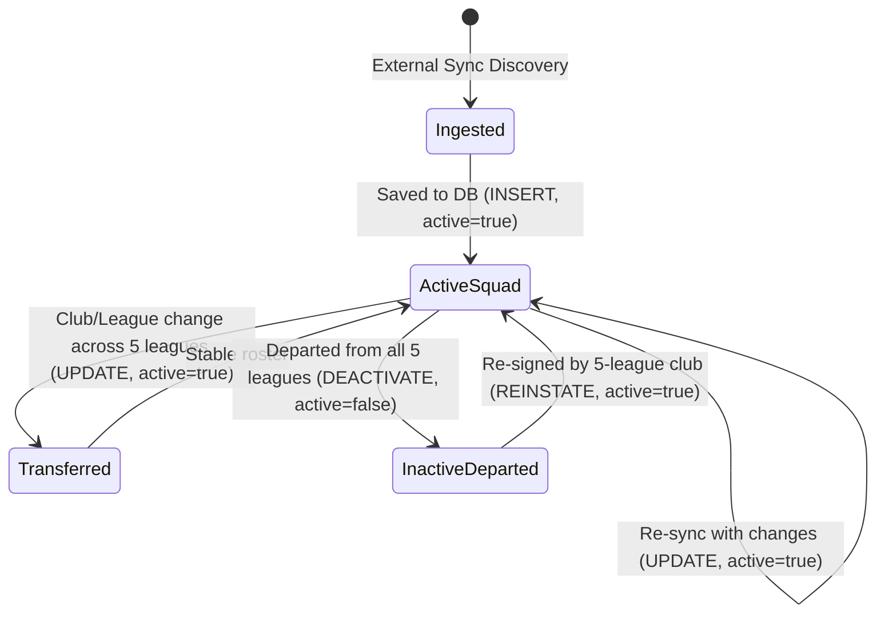

# Data Model: Player Catalog & Ingestion System

**Feature Branch**: `ft/football-data`  
**Date**: 2026-09-28  
**Feature Spec**: [spec.md](./spec.md)

## 1. Domain Entities & Value Objects (`internal/model/`)

Domain models encapsulate pure business logic and contain **no serialization tags** (`json:`, `db:`) in adherence to Constitution Principle V.

### 1.1 `Player` Entity

Represents an individual professional football athlete participating in one of the top five European leagues.

```go
package model

import "time"

type Player struct {
	ID          int64
	ExternalID  int64
	Name        string
	ClubName    string
	LeagueName  string
	LeagueCode  string
	DateOfBirth *string
	Nationality *string
	Position    string
	ShirtNumber *int
	Active      bool
	CreatedAt   time.Time
	UpdatedAt   time.Time
}
```

#### Field Specifications:
| Field | Type | Required | Description |
|---|---|---|---|
| `ID` | `int64` | Yes | Internal database primary key (auto-generated) |
| `ExternalID` | `int64` | Yes | Unique player ID from football-data.org (Person ID) |
| `Name` | `string` | Yes | Full name of the player |
| `ClubName` | `string` | Yes | Current squad/club name (e.g., "Arsenal FC") |
| `LeagueName` | `string` | Yes | Name of the league (e.g., "Premier League") |
| `LeagueCode` | `string` | Yes | League competition code (`PL`, `BL1`, `PD`, `SA`, `FL1`) |
| `DateOfBirth` | `*string` | No | ISO-8601 calendar date (`YYYY-MM-DD`), null if unknown |
| `Nationality` | `*string` | No | Country of citizenship or sporting nationality |
| `Position` | `string` | Yes | Standardized position (`Goalkeeper`, `Defender`, `Midfielder`, `Attacker` / `Forward`) |
| `ShirtNumber` | `*int` | No | Squad number in current club; null if unassigned |
| `Active` | `bool` | Yes | `true` if active in one of the 5 leagues; `false` if departed |
| `CreatedAt` | `time.Time` | Yes | Timestamp of initial record creation |
| `UpdatedAt` | `time.Time` | Yes | Timestamp of most recent update/sync |

### 1.2 `AuditLog` Entity

Represents an immutable, append-only record tracking changes to player data per Constitution Principle X.

```go
package model

import "time"

type AuditLog struct {
	ID         int64
	EntityType string
	EntityID   int64
	Action     string
	Actor      string
	DiffOld    map[string]any
	DiffNew    map[string]any
	CreatedAt  time.Time
}
```

#### Field Specifications:
| Field | Type | Description |
|---|---|---|
| `ID` | `int64` | Primary key of the audit log entry |
| `EntityType` | `string` | Domain entity type (constant `"player"`) |
| `EntityID` | `int64` | Internal player ID (`Player.ID`) |
| `Action` | `string` | Modification action: `"INSERT"`, `"UPDATE"`, `"DEACTIVATE"` |
| `Actor` | `string` | Identity of the initiator (`"system/sync"`, `"admin"`, etc.) |
| `DiffOld` | `map[string]any` | Snapshot of relevant modified attributes before change (nil for INSERT) |
| `DiffNew` | `map[string]any` | Snapshot of relevant modified attributes after change |
| `CreatedAt` | `time.Time` | UTC timestamp when the audit event occurred |

### 1.3 `PlayerFilter` Value Object

Encapsulates user search, filter, and pagination parameters.

```go
package model

type PlayerFilter struct {
	League          string
	Club            string
	Position        string
	Search          string
	IncludeInactive bool
	Page            int
	Limit           int
}
```

### 1.4 `PageResult[T]` Generic Model

Encapsulates paginated results for domain collections.

```go
package model

type PageResult[T any] struct {
	Items      []T
	Page       int
	Limit      int
	Total      int64
	TotalPages int
}
```

---

## 2. Database Schema (`backend/db/init.sql`)

PostgreSQL is accessed strictly via `database/sql` without an ORM (Constitution Principle II).

```sql
-- Players table
CREATE TABLE IF NOT EXISTS players (
    id BIGSERIAL PRIMARY KEY,
    external_id BIGINT NOT NULL UNIQUE,
    name VARCHAR(255) NOT NULL,
    club_name VARCHAR(255) NOT NULL,
    league_name VARCHAR(100) NOT NULL,
    league_code VARCHAR(10) NOT NULL,
    date_of_birth VARCHAR(20),
    nationality VARCHAR(100),
    position VARCHAR(50) NOT NULL,
    shirt_number INTEGER,
    active BOOLEAN NOT NULL DEFAULT TRUE,
    created_at TIMESTAMPTZ NOT NULL DEFAULT NOW(),
    updated_at TIMESTAMPTZ NOT NULL DEFAULT NOW()
);

-- Search and query optimization indexes (Constitution Principle XI)
CREATE INDEX IF NOT EXISTS idx_players_active ON players (active);
CREATE INDEX IF NOT EXISTS idx_players_league_code ON players (league_code);
CREATE INDEX IF NOT EXISTS idx_players_club_name ON players (club_name);
CREATE INDEX IF NOT EXISTS idx_players_position ON players (position);
CREATE INDEX IF NOT EXISTS idx_players_name ON players (name);

-- Immutable audit log table (Constitution Principle X)
CREATE TABLE IF NOT EXISTS player_audit_logs (
    id BIGSERIAL PRIMARY KEY,
    entity_type VARCHAR(50) NOT NULL,
    entity_id BIGINT NOT NULL,
    action VARCHAR(20) NOT NULL,
    actor VARCHAR(100) NOT NULL,
    diff_old JSONB,
    diff_new JSONB NOT NULL,
    created_at TIMESTAMPTZ NOT NULL DEFAULT NOW()
);

CREATE INDEX IF NOT EXISTS idx_audit_entity ON player_audit_logs (entity_type, entity_id);
CREATE INDEX IF NOT EXISTS idx_audit_created_at ON player_audit_logs (created_at);
```

---

## 3. Data Transfer Objects (`internal/dto/`)

DTOs reside in their own standalone package `internal/dto/` and serve as clean data transfer containers between architectural layers (controller, service, persistence, adapters) and across the HTTP boundary, avoiding tight coupling to internal domain model structs.

In strict compliance with Constitution Principle V:
- DTOs are distinct types separated from domain models.
- Request and response use different DTOs.
- List context and detail context have distinct DTOs.
- `DesdeModelo` builds DTO from model; `AModelo` performs the reverse.

### 3.1 Player Summary DTO (Catalog Listing View)
*Used by `GET /players` — contains only the name, current team, league, and position.*

```go
package dto

import "github.com/nicotorboli/2026s2-desapp-NoSePudo/backend/internal/model"

type PlayerListItemResponse struct {
	ID       int64  `json:"id"`
	Name     string `json:"name"`
	Club     string `json:"club"`
	League   string `json:"league"`
	Position string `json:"position"`
}

func PlayerListItemDesdeModelo(m model.Player) PlayerListItemResponse {
	return PlayerListItemResponse{
		ID:       m.ID,
		Name:     m.Name,
		Club:     m.ClubName,
		League:   m.LeagueName,
		Position: m.Position,
	}
}
```

### 3.2 Player Detail DTO (Player Detail View)
*Used by `GET /players/{id}` — contains all attributes of the player.*

```go
package dto

import (
	"time"

	"github.com/nicotorboli/2026s2-desapp-NoSePudo/backend/internal/model"
)

type PlayerDetailResponse struct {
	ID          int64   `json:"id"`
	ExternalID  int64   `json:"externalId"`
	Name        string  `json:"name"`
	Club        string  `json:"club"`
	League      string  `json:"league"`
	LeagueCode  string  `json:"leagueCode"`
	Position    string  `json:"position"`
	DateOfBirth *string `json:"dateOfBirth"`
	Nationality *string `json:"nationality"`
	ShirtNumber *int    `json:"shirtNumber"`
	Active      bool    `json:"active"`
	CreatedAt   string  `json:"createdAt"`
	UpdatedAt   string  `json:"updatedAt"`
}

func PlayerDetailDesdeModelo(m model.Player) PlayerDetailResponse {
	return PlayerDetailResponse{
		ID:          m.ID,
		ExternalID:  m.ExternalID,
		Name:        m.Name,
		Club:        m.ClubName,
		League:      m.LeagueName,
		LeagueCode:  m.LeagueCode,
		Position:    m.Position,
		DateOfBirth: m.DateOfBirth,
		Nationality: m.Nationality,
		ShirtNumber: m.ShirtNumber,
		Active:      m.Active,
		CreatedAt:   m.CreatedAt.Format(time.RFC3339),
		UpdatedAt:   m.UpdatedAt.Format(time.RFC3339),
	}
}
```

### 3.3 Paginated Catalog Response DTO

```go
package dto

type PaginatedResponse[T any] struct {
	Items      []T   `json:"items"`
	Page       int   `json:"page"`
	Limit      int   `json:"limit"`
	Total      int64 `json:"total"`
	TotalPages int   `json:"totalPages"`
}
```

---

## 4. Entity Lifecycle & State Transitions



### Lifecycle Rules:
1. **Initial Creation**: Player record is created with `active = true`, triggering an audit log entry with action `INSERT`.
2. **Attribute Update**: Player re-imported with updated attributes (shirt number, age, club) updates the existing row, updating `updated_at`, triggering an audit log entry with action `UPDATE`.
3. **Soft Deactivation**: If a previously active player is not present in any squad of the 5 leagues during a synchronization run, `active` is set to `false`. The row is preserved in `players`, and an audit log entry with action `DEACTIVATE` is written.
4. **Historical Access**: Inactive players are excluded by default (`active = true` filter) but can be viewed if `includeInactive = true` is supplied.
